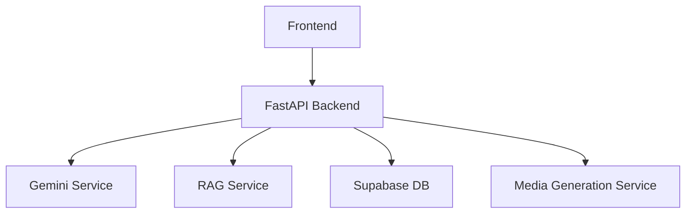

# Personal AI Teacher

A personalized AI-powered teaching assistant designed to revolutionize the learning experience through adaptive teaching, multimodal media generation, and individualized learning paths.

---

## 1. Project Overview
The Personal AI Teacher is an intelligent tutoring system that goes beyond simple Q&A. It understands the student’s profile, goals, and history to create tailored, interactive lessons. The system uses a continuous learning loop to adapt teaching strategies based on student performance and misconceptions.

## 2. Problem Statement
Traditional learning methods often struggle to provide personalized attention at scale. Students frequently face gaps in understanding that go undetected, leading to frustration and disengagement. Existing AI tools often focus solely on answering questions rather than guiding students through structured, conceptual learning.

## 3. Our Solution
Our solution provides a structured, adaptive pedagogical framework. By utilizing student performance data, the AI Teacher dynamically adjusts explanations, asks targeted questions, detects misconceptions, and generates multimodal educational content (visuals, audio, and video) to reinforce concepts.

## 4. Objectives
- Provide personalized learning experiences for students.
- Implement adaptive teaching based on real-time feedback.
- Generate high-quality educational visuals, audio, and video content.
- Support multilingual learning for inclusivity.

## 5. Key Features
- **Adaptive Teaching Loop:** Continuous understanding, planning, explanation, questioning, and evaluation.
- **Multimodal Content:** AI-generated visuals, teacher voice (TTS), and animated learning videos (SadTalker integration).
- **Misconception Detection:** Identifies conceptual errors in student answers and provides corrective adaptive feedback.
- **Personalized Learning:** Lessons tailored to the student's level, goals, and available time.
- **Multilingual Support:** Lessons generated and taught in the student's preferred language (e.g., Hindi, English).

## 6. How It Works
The system follows a core teaching loop that ensures the student is not just passive:
`Understand → Plan → Explain → Demonstrate → Question → Evaluate → Adapt → Continue`

## 7. End-to-End Teaching Workflow
1.  **Lesson Generation:** Teacher agent creates a lesson plan based on subject, topic, and student constraints.
2.  **Interactive Segment:** The teacher presents concepts through text, visuals, and voice.
3.  **Assessment:** The teacher asks a targeted question.
4.  **Adaptive Feedback:** Student answer is evaluated; if incorrect, the system detects the misconception and provides an alternative analogy or re-explanation.

## 8. System Architecture


## 9. AI/ML Architecture
The system leverages Google's Gemini models for both lesson content generation and adaptive feedback, supported by custom RAG (Retrieval-Augmented Generation) for grounding pedagogical content.

## 10. AI Teacher / Agent Architecture
The Teacher Agent orchestrates the lesson flow. It maintains a persistent state for each student in every lesson, allowing it to "remember" where the student is in the learning path.

## 11. RAG and Learning Material Processing
RAG is implemented to retrieve relevant educational context from uploaded study materials (e.g., PDFs), ensuring that AI-generated lessons are grounded in authoritative source content.

## 12. Personalized Learning
Student profiles—including name, grade, preferred language, current level, and learning goals—are injected into the prompt context for every lesson generation request.

## 13. Adaptive Teaching and Misconception Detection
The evaluation engine analyzes student answers. When a misconception is detected, the adaptive service generates a specific corrective response or re-explanation strategy (e.g., Simpler explanation, Analogy, Lowering difficulty).

## 14. Multilingual Learning
The system supports language resolution at two levels:
- **Per-lesson selection:** Users can override the default language in the generator form.
- **Profile-based:** Defaults to the student's preferred language.

## 15. AI Voice
Generates educational audio using text-to-speech services, allowing the teacher to provide auditory explanations.

## 16. AI Avatar and Video Generation
The repository includes integration for `SadTalker` to generate animated videos from a source image and driving audio, producing personalized, animated teacher presentations.

## 17. Interactive Questioning and Assessment
The teaching loop includes periodic assessment segments where students must respond to conceptual questions. Their performance directly influences the adaptation loop.

## 18. Student Progress and Learning History
Student progress and past assessments are stored in Supabase, providing a historical view of mastery in various topics.

## 19. Learning Path and Next-Topic Recommendation
The system uses progress data to suggest the next concepts to study, ensuring a logical progression.

## 20. Technology Stack
- **Frontend:** HTML, Vanilla CSS, JavaScript.
- **Backend:** FastAPI, Python.
- **Database:** Supabase (PostgreSQL).
- **AI/LLM:** Google Gemini API.
- **Media:** SadTalker, TTS Services.

## 21. Database Architecture
Primary tables include:
- `students`: Profile information.
- `lessons`: Generated lesson content and metadata.
- `student_progress`: Concept mastery levels.
- `assessment_results`: Student answer history.
- `lesson_state`: Persistent state tracking during an active lesson.

## 22. API Architecture
The backend is structured by functionality, with core modules:
- `/api/lesson`: Lesson creation, adaptive teaching, state management.
- `/api/students`: Profile and dashboard data.
- `/api/adaptive`: Evaluation, adaptation, and step progression.

## 23. Project Structure
```text
/
├── backend/
│   ├── api/          # FastAPI route handlers
│   ├── database/     # Supabase client setup
│   ├── models/       # Pydantic data schemas
│   ├── services/     # Core business/AI logic
│   └── media/        # Generated audio/video/visuals
├── frontend/         # Web UI assets
├── SadTalker/        # Animation engine
└── docs/             # API and architecture docs
```

## 24. Installation and Setup
1. Clone the repository.
2. Install Python dependencies: `pip install -r backend/requirements.txt`
3. Configure environment variables (copy `.env.example` to `.env` and set appropriate Supabase keys).
4. Start the backend: `python backend/main.py`
5. Open `frontend/index.html` in a web browser.

## 25. Environment Variables
Refer to `.env.example` for required configuration keys. Ensure all mandatory API keys (Supabase, Gemini) are set. **Never commit your `.env` file.**

## 26. Running the Backend
Run the FastAPI server:
```bash
python backend/main.py
```

## 27. Running the Frontend
Simply open `frontend/index.html` in any modern web browser.

## 28. Demo Workflow
1. Navigate to the dashboard (demo mode active).
2. Click "Start Demo" in the header to load the "Newton's Third Law" lesson.
3. Follow the teacher's explanation.
4. Respond to questions to trigger adaptive feedback.

## 29. Testing and Validation
- Backend APIs can be tested using `curl` or tools like Postman.
- Frontend logic is verified using local browser testing and `node --check` syntax validation for scripts.

## 30. Security and Privacy
The implementation currently uses a local development bypass for demo purposes. Production environments should replace this with standard JWT-based authentication using Supabase Auth.

## 31. Known Limitations
- Heavy dependence on external AI model availability and rate limits (e.g., occasional 503 errors during high demand).
- Animation/Video generation is computationally intensive and requires specific environment hardware/dependencies.

## 32. Future Enhancements
- Integration of a more robust, persistent user authentication system.
- Expansion of the adaptive teaching engine to include more complex branching scenarios.
- Optimized, real-time media generation streaming.

## 33. Team QUAFIN

## 34. Conclusion
The Personal AI Teacher provides a scalable, personalized learning platform that adapts to individual student needs, bridging the gap between automated instruction and personalized human-like tutoring.
